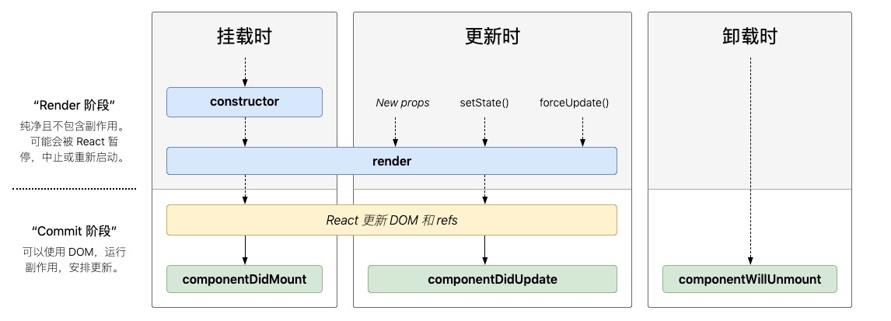
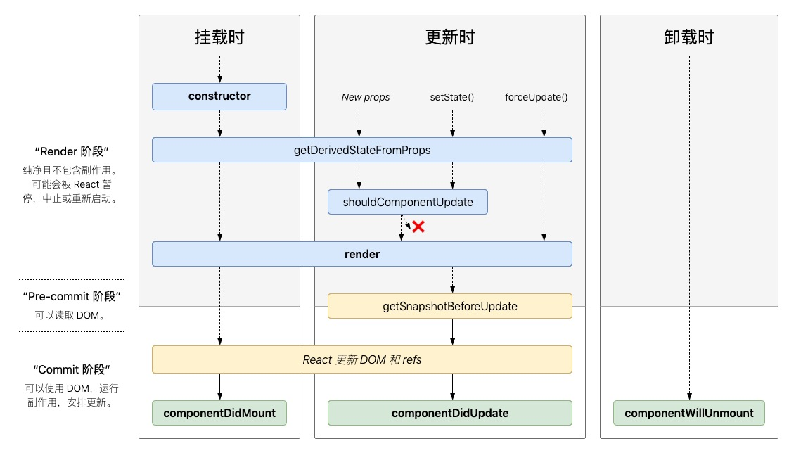

# 20200409

## requestAnimationFrame 的使用

### 参考链接

[你需要知道的requestAnimationFrame](https://juejin.im/post/5a82f0626fb9a06358657c9c)

### 要点

顾名思义，这是针对动画的一个API，这个API所解决的问题主要是避免JS操作动画时执行的不连贯。

比如将一个div从0宽度增加到500的宽度，我们可以用setInterval来实现：

```javascript
const timer = null;
timer = setInterval(function(){
    if(parseInt(myDiv2.style.width) < 500){
        myDiv2.style.width = parseInt(myDiv2.style.width) + 1 + 'px';
        myDiv2.innerHTML = parseInt(myDiv2.style.width)/5 + '%';
    }else{
        clearInterval(timer);
    }
}, 16);
```

我们希望每16毫秒执行一次宽度的运算操作，但是由于js是单线程的，其特殊的事件循环并不能保证setInterval能够在16毫秒内执行，所以就会造成动画运行起来的卡顿。

为了保证该函数可以在16毫秒内执行，我们可以使用requestAnimationFrame进行替换setInterval，实现如下：

```javascript
const timer = null;
timer = requestAnimationFrame(function fn (){
    if(parseInt(myDiv.style.width) < 500) {
        myDiv.style.width = parseInt(myDiv.style.width)  + 1 + 'px';
        myDiv.innerHTML = parseInt(myDiv.style.width)/5 + '%';
        timer = requestAnimationFrame(fn);
    }else{
        cancelAnimationFrame(timer);
    }
}
```

## 深度优先搜索


```typescript
interface TreeItem {
    id: number;
    children: TreeItem[];
}

function depthFirstSearchWithRecursive(source: TreeItem[]) {
    const result = [];
    function dfs(data: TreeItem[]) {
        data.forEach(function (item) {
            result.push(item.id);
            if (item.children) {
                dfs(item.children);
            }
        })
    }
    dfs(source);
    return result;
}

function depthFirstSearchWithNoRecursive(source: TreeItem) {
  const result = [];
  const queue = [source];
  while (queue.length > 0) {
    const item = queue.pop();
    result.push(item.id)
    if (item.children && item.children.length > 0) {
      item.children.forEach(i => queue.push(i));
    }
  }
}
```

[参考](https://segmentfault.com/a/1190000004620352)

对于二叉树来说，假设有如下二叉树：

```javascript
var tree = {
  value: 1,
  left: {
    value: 1.1,
    left: {
      value: 1.1.1
    },
    right: {
      value: 1.1.2
    }
  },
  right: {
    value: 1.2,
    left: {
      vlaue: 1.2.1
    }
    right: {
      value: 1.2.2
    }
  }
}
```

对于二叉树，前序优先遍历，中序优先遍历与后序优先遍历都属于深度优先遍历。

```javascript

// 前序优先遍历
function DLR(root) {
  if (!root) {
    reutrn null;
  }

  console.log(root.value);

  if (root.left) {
    DLR(root.left);
  }

  if (root.right) {
    DLR(root.right);
  }
}

// 中序遍历
function LDR(root) {
  if (!root) {
    reutrn null;
  }

  if (root.left) {
    DLR(root.left);
  }

  console.log(root.value);

  if (root.right) {
    DLR(root.right);
  }
}

// 后序遍历
function LRD(root) {
  if (!root) {
    reutrn null;
  }

  if (root.left) {
    DLR(root.left);
  }

  if (root.right) {
    DLR(root.right);
  }
  console.log(root.value);
}

```

## 广度优先搜索/广度优先搜索

**它是什么？**

对于一颗树来说，广度优先搜索是指从数的第一层（根节点）开始，自上至下逐层遍历，在同一层上，按照自左到右逐层遍历。

```typescript
interface TreeItem {
    id: number;
    children: TreeItem[];
}

function bfs = (source: TreeItem) => {
    const result = [];
    const queue = [source];

    while(queue.length > 0) {
        const item = queue.shift();
        result.push(item.id);

        if (item.children && item.children.length > 0) {
            item.children.forEach(i => queue.push(i));
        }
    }

    return result;
}
```


## 盒模型

W3C标准盒模型与IE盒模型

box-sizing:

标准盒模型 -- 宽度 = content的宽度
IE盒模型 -- 宽度 = content的宽度 + padding的宽度 + border的宽度

content-box -- width为content的宽度

padding-box -- width为content的宽度 + 左右padding

border-box -- width为content的宽度 + 左右padding + 左右border

## BFC--块级格式化上下文

BFC的创建方法

1. 根元素
2. 浮动元素
3. 绝对定位元素(position：absolute或fixed)
4. 行内块级元素(display: inline-block)
5. 表格单元格(display: table-cell)
6. overflow的值不为visible的元素
7. 弹性盒 flex boxes(元素的display: flex)

BFC特性

1. 内部的盒会在垂直方向一个接一个排列（可以看作BFC中有一个的常规流）；
2. 处于同一个BFC中的元素相互影响，可能会发生margin collapse；
3. 每个元素的margin box的左边，与容器块border box的左边相接触(对于从左往右的格式化，否则相反)。即使存在浮动也是如此；
4. BFC就是页面上的一个隔离的独立容器，容器里面的子元素不会影响到外面的元素，反之亦然；
5. 计算BFC的高度时，考虑BFC所包含的所有元素，连浮动元素也参与计算；
6. 浮动盒区域不叠加到BFC上；

BFC作用

1. 清除浮动
2. 左右两栏布局

[参考](https://zhuanlan.zhihu.com/p/25321647)

## 20200412

### typescript i操作符--非空断言标志符

```javascript
const config = {
  port: 8000
};

// 如果没有非空断言，需要对config进行判断
if (config) {
  console.log(config.port);
}

// 这样用就可以了
console.log(config!.port);
```

### webpack 构建流程

* 解析配置参数--解析webpack配置参数，合并从shell传入和webpack.config.js文件里配置的参数，生产最后的配置结果。
* 注册插件--注册所有配置的插件，好让插件监听webpack构建生命周期的事件节点，以做出对应的反应。
* 构建抽象语法树AST--从配置的entry入口文件开始解析文件构建AST语法树，找出每个文件所依赖的文件，递归下去。
* 对不同文件用不同的loader转换--在解析文件递归的过程中根据文件类型和loader配置找出合适的loader用来对文件进行转换。
* 生成代码块--递归完后得到每个文件的最终结果，根据entry配置生成代码块chunk。
* 输出到文件系统--输出所有chunk到文件系统。

### 编写babel插件

babel运行原理

1. babel将js代码转换为AST
2. babel的各种plugin对AST进行转换
3. 输出新的代码字符串

编写babel插件，就是处理babel在对AST进行转换时的钩子函数，对相应的节点进行操作。

```javascript
// 将 bad 转为 good
module.exports = function({ types: babelTypes }) {
  return {
    name: 'deadly-simple-plugin-example',
    visitor: {
      Identifier(path, state) {
        if (path.node.name === 'bad') {
          path.node.name = 'good';
        }
      }
    }
  }
}
// index.js 
let bad = 'oh';
> let goog = 'oh';
```

```javascript
// 给async函数包裹try-catch

function alreadyWrapped (node,t) {
  let body = node.body.body;
  return body && body.length === 1 && t.isTryStatement(body[0]);
}

function wrap (node, callback = 'asyncError') {
  return {
      "body": [
          {
              "block": node,
              "finalizer": null,
              "handler": {
                  "body": {
                      "body": [
                          {
                              "expression": {
                                  "arguments": [
                                      {
                                          "type": "ThisExpression"
                                      },
                                      {
                                          "name": "error",
                                          "type": "Identifier"
                                      }
                                  ],
                                  "callee": {
                                      "computed": false,
                                      "object": {
                                          "name": 'console',
                                          "type": "Identifier"
                                      },
                                      "property": {
                                          "name": "error",
                                          "type": "Identifier"
                                      },
                                      "type": "MemberExpression"
                                  },
                                  "type": "CallExpression"
                              },
                              "type": "ExpressionStatement"
                          }
                      ],
                      "type": "BlockStatement"
                  },
                  "param": {
                      "name": "error",
                      "type": "Identifier"
                  },
                  "type": "CatchClause"
              },
              "type": "TryStatement"
          }
      ],
      "type": "BlockStatement"
  }
}

module.exports = function(babel) {
  var t = babel.types;
  return {
    name: 'async-wrap',
    visitor: {
      Function(path,state) {
        if (state.opts && !state.opts['addAsyncTry']) {
            return;
        }
        var  node= path.node
        if (node.async && !alreadyWrapped(node,t)) {
            node.body = wrap(node.body);
        }
      },
    }
  };
};

// 输入
async function printFile (filename) {
  let contents = await fs.readFileAsync(filename, 'utf8');
  console.log(contents);
}

// 输出
async function printFile(filename) {
  try {
    let contents = await fs.readFileAsync(filename, 'utf8');
    console.log(contents);
  } catch (error) {
    console.error(this, error);
  }
}
```

## 20200414

### 面向对象变成SOLID原则

S(单一功能原则): 认为对象应该仅具有一种单一功能的概念。
O(开闭原则): 认为“软件体应该是对于扩展开放的，但是对于修改封闭的”的概念。
L(里氏替换原则): 认为“程序中的对象应该是可以在不改变程序正确性的前提下被它的子类所替换的”的概念。
参考契约式设计。
I(接口隔离原则): 认为“多个特定客户端接口要好于一个宽泛用途的接口”[5] 的概念。
D(依赖反转原则): 认为一个方法应该遵从“依赖于抽象而不是一个实例”[5] 的概念。
依赖注入是该原则的一种实现方式。

## 20200416

### XSS(跨站脚本攻击)

类型

1.反射型XSS

反射型XSS只是简单的把用户输入的数据“反射”给浏览器，一种理解是有恶意代码放在url上，然后url的代码被插入到HTML中执行。

2.储存型XSS

储存型XSS会把用户输入的数据“储存”在服务器端。

防御

就是在输入的时候没有做严格的过滤，而在输出的时候，也没有进行检查，转义，替换等

## 20200420

### 控制反转(IOC)与依赖注入(DI)

大多数面向对象编程语言，在调用一个类的时候，先要实例化这个类，生成一个对象。如果你在写一个类，过程中要调用到很多其它类，甚至这里的其它类，也要“依赖”于更多其它的类，那么可以想象，你要进行多少次实例化。这就是“依赖”的意思。依赖注入，全称是“依赖注入到容器”， 容器（IOC容器）是一个设计模式，它也是个对象，你把某个类（不管有多少依赖关系）放入这个容器中，可以“解析”出这个类的实例。所以依赖注入就是把有依赖关系的类放入容器（IOC容器）中，然后解析出这个类的实例。仅此而已。

作者：唐思
链接：https://www.zhihu.com/question/32108444/answer/54773302
来源：知乎
著作权归作者所有。商业转载请联系作者获得授权，非商业转载请注明出处。

### 2020.04.21

### JWT(JSON Web Token)

JWT是最流行的跨域认证解决方案，用于用户认证。

JWT原理：

服务器认证之后，会生成一个JSON对象，返回给用户，用户再次访问的时候，都要发回这个对象，服务器只靠这个对象来验证用户身份。

```javascript
// 就类似于这样的一个JSON
{
  "姓名": "张三",
  "角色": "管理员",
  "到期时间": "2018年7月1日0点0分"
}
```

用户会收到这样一个字符串，分为三部分：`Header(头部).Payload(负载).Signature(签名)`

为了防止数据篡改，签名部分会用只有服务器才有的秘钥进行加密处理。

## 2020.04.22

### [ORM(Object Relational Mapping 对象关系映射)](http://www.ruanyifeng.com/blog/2019/02/orm-tutorial.html)

简单说，ORM 就是通过实例对象的语法，完成关系型数据库的操作的技术，是"对象-关系映射"（Object/Relational Mapping） 的缩写。

映射关系：

数据库的表（table） --> 类（class）

记录（record，行数据）--> 对象（object）

字段（field）--> 对象的属性（attribute）

### 拉取（pull） & 推送（push）

学习RxJS的过程中，接触到了拉取与推送协议，用来描述生产者（Producer）与消费者（Consumer）如何通信

什么是拉取？ - 在拉取体系中，由消费者来决定何时从生产者那里接收数据。生产者本身不知道数据是何时交付到消费者手中的。
每个 JavaScript 函数都是拉取体系。函数是数据的生产者，调用该函数的代码通过从函数调用中“取出”一个单个返回值来对该函数进行消费。

什么是推送？ - 在推送体系中，由生产者来决定何时把数据发送给消费者。消费者本身不知道何时会接收到数据。
Promise(生产者) 将一个解析过的值传递给已注册的回调函数(消费者)，但不同于函数的是，由 Promise 来决定何时把值“推送”给回调函数。

### Observable与函数的区别

Observables 传递值可以是同步的，也可以是异步的。
Observable 可以随着时间的推移“返回”多个值。

## 20200424

### 对__dirname，__filename，process.cwd()，./的总结

__dirname： 获得当前执行文件所在目录的完整目录名
__filename： 获得当前执行文件的带有完整绝对路径的文件名
process.cwd()：获得当前执行node命令时候的文件夹目录名
./： 不使用require时候，./与process.cwd()一样，使用require时候，与__dirname一样

### [path.resolve path.join](https://juejin.im/post/5cfc96c5f265da1b8333805a)

1、join是把各个path片段连接在一起， resolve把‘／’当成根目录

```javascript
path.join('/a', '/b'); 
// /a/b
path.resolve('/a', '/b');
// /b
```

2、resolve在传入非/路径时，会自动加上当前目录形成一个绝对路径，而join仅仅用于路径拼接

```javascript
// 当前路径为
/Users/xiao/work/test
path.join('a', 'b', '..', 'd');
// a/d
path.resolve('a', 'b', '..', 'd');
// /Users/xiao/work/test/a/d
```

## 20200426

### Array.prototype.indexof() vs Array.prototype.include()

include()于ES7新增

语法：`arr.includes(element, fromIndex = 0)`

`element` 为需要查找的元素。

`fromIndex` 表示从该索引位置开始查找 element，缺省为0，它是正向查找，即从索引处往数组末尾查找。

indexOf() 方法用于查找元素在数组中第一次出现时的索引，如果没有，则返回-1

语法：arr.indexOf(element, fromIndex=0)

element 为需要查找的元素。

fromIndex 为开始查找的位置，缺省默认为0。

区别：

二者除了返回值有区别外，还有一点需要注意的是，include方法可以查找NaN，但是include不行，由此可以引申来看，javascript中比较特殊的东西就是NaN，需要时刻注意。

如何判断是否是NaN？

```javascript
function isNaN(a) {
  return a !== a;
}
```

### [哈希算法](https://zhuanlan.zhihu.com/p/37165658)

哈希算法(Hash Algorithm)又称散列算法、散列函数、哈希函数，是一种从任何一种数据中创建小的数字“指纹”的方法。

哈希算法通常有以下几个特点：

1. 正像快速：原始数据可以快速计算出哈希值
2. 逆向困难：通过哈希值基本不可能推导出原始数据
3. 输入敏感：原始数据只要有一点变动，得到的哈希值差别很大
4. 冲突避免：很难找到不同的原始数据得到相同的哈希值

哈希算法主要有MD4、MD5、SHA。

## 20200428

### React 生命周期

常用生命周期：



不常用生命周期：



*挂载时执行顺序：*

`constructor()`

`static getDerivedStateFromProps()`

`render()`

`componentDidMount()`

*更新时执行顺序：*

`static getDerivedStateFromProps()`

`shouldComponentUpdate()`

`render()`

`getSnapshotBeforeUpdate()`

`componentDidUpdate()`

*卸载时执行顺序：*

`componentWillUnmount()`

*错误处理:*

当渲染过程，生命周期，或子组件的构造函数中抛出错误时，会调用如下方法：

`static getDerivedStateFromError()`

`componentDidCatch()`

### React.PureComponent  vs React.Component

React.PureComponent实现了`shouldComponentUpdate()`方法，而后者没有实现

React.PureComponent 中的 shouldComponentUpdate() 仅作对象的浅层比较。如果对象中包含复杂的数据结构，则有可能因为无法检查深层的差别，产生错误的比对结果。

### React.memo 

它与 React.PureComponent 非常相似，但只适用于函数组件，而不适用 class 组件。

如果你的函数组件在给定相同 props 的情况下渲染相同的结果，那么你可以通过将其包装在 React.memo 中调用，以此通过记忆组件渲染结果的方式来提高组件的性能表现。

### ES6 扩展操作符

```javascript
const a = {
  userId: 3,
  username: 'maria',
  password: 'guess',
};

const {password, ...result} = a

// 这里，result的值为
{userId: 3, username: "maria"}
```

## 20200429

### `Symbol.hasInstance`

刚刚看babel编译class为ES5，看到了一个方法，用来判断一个`对象`是不是属于某个`构造函数`，有一个`_instanceof`函数实现如下：

```javascript
function _instanceof(left, right) {
  if (
    right != null
    && typeof Symbol !== "undefined" 
    && right[Symbol.hasInstance]
  ) {
    return !!right[Symbol.hasInstance](left);
  } else {
    return left instanceof right;
  }
}
```

其中我们发现，有一个很怪异的关键字`Symbol.hasInstance`，不是非常常用，经过调研，Symbol.hasInstance属性指向一个内部方法，当使用`instanceof`操作符的时候，会调用这个方法。所以，我们可以通过重写这个方法，来改变instanceof操作符的行为。

看如下示例：

```javascript
class Even {
  static [Symbol.hasInstance](obj) {
    return Number(obj) % 2 === 0;
  }
}
x = new Even()
console.log(1 instanceof Even);//false
console.log(2 instanceof Even);//true
console.log(x instanceof Even);//true 原本判断x是否为Even的实例的方法，被改成了传入的数字%2===0。所以此刻是false。
```

### `constructor`中调用`super`到底发生了什么？

比如有如下代码：

```javascript
class Person {
	constructor(name, age) {
    this.name = name;
    this.age =age;
  }

  name = '';
  age = '';
  
	speak() {
    console.log('Hello Word')
	}
}

class Xiaohong extends Person {
	constructor() {
		super('xiaohong', 18)
	}
  
  apeak() {
    console.log('I am xiaohong')
  }
}
```

上面的代码中，Xiaohong类的构造函数里调用了super()，要想理解super，就需要知道这段代码执行的流程，好在我们可以把ES6的代码翻译成ES5，这就可以方便看出这段代码是如何执行的了。

经过babel编译后的代码，可以看[这里](./data/study.super.js)

以上的代码，还是有一些复杂了，来自己写一个吧！

```javascript
function Person(name, age) {
  this.name = name;
  this.age = age;
}

Person.prototype.speak = function speak () {
  console.log('Hello Word')
}

function Xiaohong() {
  Person.call(this, name, age);
}

Xiaohong.prototype = Person.prototype;
```

所以，由此来看，super()所做的事情无非就是将当前对象的this指向父构造函数，从而将父类构造函数中的属性据为己有。

