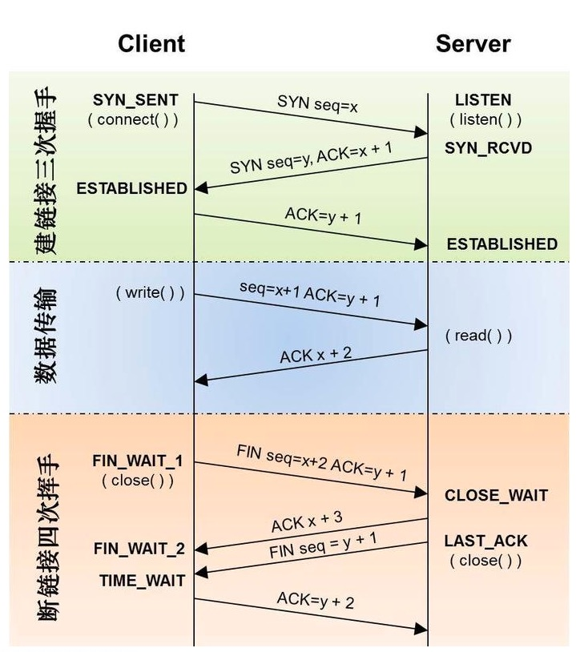
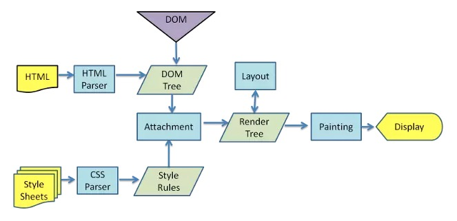

# 2020年5月

## 20200506

### 页面输入url到解析的过程

1. 域名解析（域名到ip地址的映射）

2. 建立TCP连接

  TCP三次握手

3. 浏览器向服务器发送HTTP请求

  常用请求头

4. 浏览器接收到服务器端的响应

  常用状态码

  常用响应头

5. 浏览器解析响应

6. 关闭TCP连接

### TCP三次握手



1. 客户端向服务端发送请求（SYN seq=x）

2. 服务端进行确认（SYN ack=x+1, seq=y）

3. 客户端向服务器进行确认（SYN ack=y+1）

### 四次挥手

1. 第一次分手：主机1（可以是客户端，也可以是服务器端），设置Sequence Number和Acknowledgment Number，向主机2发送一个FIN报文段；此时，主机1进入FIN_WAIT_1状态；这表示主机1没有数据要发送给主机2了；

2. 第二次分手：主机2收到了主机1发送的FIN报文段，向主机1回一个ACK报文段，Acknowledgment Number为Sequence Number加1；主机1进入FIN_WAIT_2状态；主机2告诉主机1，我“同意”你的关闭请求；

3. 第三次分手：主机2向主机1发送FIN报文段，请求关闭连接，同时主机2进入LAST_ACK状态；

4. 第四次分手：主机1收到主机2发送的FIN报文段，向主机2发送ACK报文段，然后主机1进入TIME_WAIT状态；主机2收到主机1的ACK报文段以后，就关闭连接；此时，主机1等待2MSL后依然没有收到回复，则证明Server端已正常关闭，那好，主机1也可以关闭连接了。

### 为何要三次握手

在谢希仁著《计算机网络》第四版中讲“三次握手”的目的是“为了防止已失效的连接请求报文段突然又传送到了服务端，因而产生错误”。
client发出的第一个连接请求报文段并没有丢失，而是在某个网络结点长时间的滞留了，以致延误到连接释放以后的某个时间才到达server。本来这是一个早已失效的报文段。但server收到此失效的连接请求报文段后，就误认为是client再次发出的一个新的连接请求。于是就向client发出确认报文段，同意建立连接。假设不采用“三次握手”，那么只要server发出确认，新的连接就建立了。由于现在client并没有发出建立连接的请求，因此不会理睬server的确认，也不会向server发送数据。但server却以为新的运输连接已经建立，并一直等待client发来数据。这样，server的很多资源就白白浪费掉了。

### 为什么要四次挥手

TCP协议是一种面向连接的、可靠的、基于字节流的运输层通信协议。TCP是全双工模式，这就意味着，当主机1发出FIN报文段时，只是表示主机1已经没有数据要发送了，主机1告诉主机2，它的数据已经全部发送完毕了；但是，这个时候主机1还是可以接受来自主机2的数据；当主机2返回ACK报文段时，表示它已经知道主机1没有数据发送了，但是主机2还是可以发送数据到主机1的；当主机2也发送了FIN报文段时，这个时候就表示主机2也没有数据要发送了，就会告诉主机1，我也没有数据要发送了，之后彼此就会愉快的中断这次TCP连接。

### HTTP Keep-Alive

在http早期，每个http请求都要求打开一个tpc socket连接，并且使用一次之后就断开这个tcp连接。

使用keep-alive可以改善这种状态，即在一次TCP连接中可以持续发送多份数据而不会断开连接。通过使用keep-alive机制，可以减少tcp连接建立次数，也意味着可以减少TIME_WAIT状态连接，以此提高性能和提高http服务器的吞吐率。

http keep-alive是为了让tcp活得更久一点，以便在同一个连接上传送多个http，提高socket的效率。

### 常见状态码

1**：服务器收到请求，需要请求者进一步操作

2**：请求成功

3**：重定向，资源被转移到其它URL了

4**：客户端错误，请求语法错误或没有找到相应资源

5**：服务端错误，server error

301：资源(网页等)被永久转移到其它URL，返回值中包含新的url，浏览器会自动定向到新的url

302：临时转移，客户端应访问原有URL

304：Not Modified，指定日期后未修改，不返回资源

403：服务器拒绝执行请求

404：请求的资源(网页等)不存在

500：内部服务器错误

响应头主要由Cache-Control、 Connection、Date、Pragma等组成;

### 常见请求头

Accept: 接收类型，表示浏览器支持的MIME类型（对标服务端返回的Content-Type）

Accept-Encoding：浏览器支持的压缩类型,如gzip等,超出类型不能接收

Content-Type：客户端发送出去实体内容的类型

Cache-Control: 指定请求和响应遵循的缓存机制，如no-cache

If-Modified-Since：对应服务端的Last-Modified，用来匹配看文件是否变动，只能精确到1s之内，http1.0中

Expires：缓存控制，在这个时间内不会请求，直接使用缓存，http1.0，而且是服务端时间

Max-age：代表资源在本地缓存多少秒，有效时间内不会请求，而是使用缓存，http1.1中

If-None-Match：对应服务端的ETag，用来匹配文件内容是否改变（非常精确），http1.1中

Cookie: 有cookie并且同域访问时会自动带上

Connection: 当浏览器与服务器通信时对于长连接如何进行处理,如keep-alive

Host：请求的服务器URL

Origin：最初的请求是从哪里发起的（只会精确到端口）,Origin比Referer更尊重隐私

Referer：该页面的来源URL(适用于所有类型的请求，会精确到详细页面地址，csrf拦截常用到这个字段)

User-Agent：用户客户端的一些必要信息，如UA头部等

### 常见响应头

Access-Control-Allow-Headers: 服务器端允许的请求Headers

Access-Control-Allow-Methods: 服务器端允许的请求方法

Access-Control-Allow-Origin: 服务器端允许的请求Origin头部（譬如为*）

Content-Type：服务端返回的实体内容的类型

Date：数据从服务器发送的时间

Cache-Control：告诉浏览器或其他客户，什么环境可以安全的缓存文档

Last-Modified：请求资源的最后修改时间

Expires：应该在什么时候认为文档已经过期,从而不再缓存它

Max-age：客户端的本地资源应该缓存多少秒，开启了Cache-Control后有效

ETag：请求变量的实体标签的当前值

Set-Cookie：设置和页面关联的cookie，服务器通过这个头部把cookie传给客户端

Keep-Alive：如果客户端有keep-alive，服务端也会有响应（如timeout=38）

Server：服务器的一些相关信息

响应体为服务器返回给浏览器的信息，主要由HTML，css，js，图片文件组成;

## 回流与重绘

回答这个问题之前，先说明一下浏览器渲染原理：

浏览器将html解析成DOM，将css解析成CSSOM，最后两者结合为rendering tree，此时rendering还没有里还没有元素的几何信息。然后进行布局（layout），此时节点具有了大小及位置信息，最后渲染到页面上。

我们要知道，DOM树中是不包含不可见元素的，比如display: 为none的标签和meta标签等，如果使display为none的元素可见，就需要重新构建那一部分DOM树，此时也就发生了回流。但是对于只改变一些元素的外观，不涉及到布局的改变的时候，是不需要重新构建DOM结构的，只需要改变一下对应的样式重新绘制就可以。



**回流**：当render tree中的一部分(或全部)因为元素的规模尺寸，布局，隐藏等改变而需要重新构建。（文档的排版需要改变）

**重绘**：当render tree中的一些元素需要更新属性，而这些属性只是影响元素的外观，风格，而不会影响布局的，比如background-color。

### 减少回流重绘

使用cssText

```javascript
const el = document.getElementById('test');
el.style.cssText += 'border-left: 1px; border-right: 2px; padding: 5px;';
```

2. 批量修改DOM

(1) 使元素脱离文档流
(2) 对其进行多次修改
(3) 将元素带回到文档中

3. 对于复杂动画效果,使用绝对定位让其脱离文档流

4. css3硬件加速（GPU加速）

## 20200507 

### 

**什么是CSRF**

CSRF（Cross-site request forgery）跨站请求伪造：攻击者诱导受害者进入第三方网站，在第三方网站中，向被攻击网站发送跨站请求。利用受害者在被攻击网站已经获取的注册凭证，绕过后台的用户验证，达到冒充用户对被攻击的网站执行某项操作的目的。

**防护策略**

CSRF通常从第三方网站发起，被攻击的网站无法防止攻击发生，只能通过增强自己网站针对CSRF的防护能力来提升安全性。

上文中讲了CSRF的两个特点：

CSRF（通常）发生在第三方域名。

CSRF攻击者不能获取到Cookie等信息，只是使用。

针对这两点，我们可以专门制定防护策略，如下：

阻止不明外域的访问

同源检测

Samesite Cookie

提交时要求附加本域才能获取的信息

*CSRF Token*

双重Cookie验证

## 20200508

### 

**常见的媒体格式类型如下：**

text/html ： HTML格式

text/plain ：纯文本格式

text/xml： XML格式

image/gif ：gif图片格式

image/jpeg ：jpg图片格式

image/png：png图片格式

以application开头的媒体格式类型：

application/xhtml+xml ：XHTML格式

application/xml： XML数据格式

application/atom+xml ：Atom XML聚合格式

application/json： JSON数据格式

application/pdf：pdf格式

application/msword ： Word文档格式

application/octet-stream ： 二进制流数据（如常见的文件下载）

application/x-www-form-urlencoded ： `<form encType=””>`中默认的`encType`，`form`表单数据被编码为`key/value`格式发送到服务器（表单默认的提交数据的格式）

另外一种常见的媒体格式是上传文件之时使用的：

multipart/form-data ： 需要在表单中进行文件上传时，就需要使用该格式

### 手写ajax及jsonp

**ajax实现**

```javascript
//对请求data进行格式化处理
function formateData(data) {
    let arr = [];
    for (let key in data) {
        //避免有&,=,?字符，对这些字符进行序列化
        arr.push(encodeURIComponent(key) + '=' + data[key])
    }
    return arr.join('&');
}

function ajax(params) {
    //先对params进行处理，防止为空
    params = params || {};
    params.data = params.data || {};

    //普通GET,POST请求
    params.type = (params.type || 'GET').toUpperCase();
    params.data = formateData(params.data);
    //如果是在ie6浏览器，那么XMLHttoRequest是不存在的，应该调用ActiveXObject；
    let xhr = XMLHttpRequest ? new XMLHttpRequest() : new ActiveXObject('Microsoft.XMLHTTP');
    if (params.type === 'GET') {
        xhr.open(params.type, params.url + '?' + params.data, true);
        xhr.send();
    } else {
        xhr.open(params.type, params.url, true);
        xhr.setRequestHeader("Content-type", "application/x-www-form-urlencoded")
        xhr.send(params.data);
    }
    // 这里有两种写法，第一种写法：当xhr.readyState===4的时候，会触发onload事件，直接通过onload事件 进行回调函数处理
    xhr.onload = function () {
        if (xhr.status === 200 || xhr.status === 304 || xhr.status === 206) {
            var res;

            if (params.success && params.success instanceof Function) {
                res = JSON.parse(xhr.responseText);
                params.success.call(xhr, res);
            }
        } else {
            if (params.error && params.error instanceof Function) {
                res = xhr.responseText;
                params.error.call(xhr, res);
            }
        }

    }
    //第二种写法，当xhr.readyState===4时候，说明请求成功返回了，进行成功回调
    xhr.onreadystatechange = function () {
        if (xhr.readyState === 4) {
            // 进行onload里面的处理函数
        }
    }

}
```

**jsonp实现--客户端**

```javascript
//对请求data进行格式化处理
function formateData(data) {
    let arr = [];
    for (let key in data) {
        //避免有&,=,?字符，对这些字符进行序列化
        arr.push(encodeURIComponent(key) + '=' + data[key])
    }
    return arr.join('&');
}

//跨域jsonp请求
function jsonp(params) {
    //先对params进行处理，防止为空
    params = params || {};
    params.data = params.data || {};
    //后台传递数据时调用的函数名
    var callbackName = params.jsonp;
    // 拿到dom元素head，先不进行操作
    var head = document.querySelector('head');
    //创建script元素，先不进行操作
    var script = document.createElement('script');
    //传递给后台的data数据中，需要包含回调参数callback。
    //callback的值是 一个回调函数的函数名，后台通过该回调函数名调用传递数据，这个参数名的key由双方约定，默认为callback
    params.data['callback'] = callbackName;
    //对data数据进行格式化
    var data = formateData(params.data);
    //设置script请求的url跟数据
    script.src = `${params.url}?${data}`;
    //全局函数 由script请求后台，被调用的函数，只有后台成功响应才会调用该函数
    window[callbackName] = function (jsonData) {
        //请求移除scipt标签
        head.removeChild(script);
        clearTimeout(script.timer);
        window[callbackName] = null;
        params.success && params.success(jsonData)
    }
    //请求超时的处理函数
    if (params.time) {
        script.timer = setTimeout(() => {
            //请求超时对window下的[callbackName]函数进行清除，由于有可能下次callbackName发生改变了
            window[callbackName] = null;
            //移除script元素，无论请求成不成功
            head.removeChild(script)
            //这里不需要清除定时器了，clearTimeout(script.timer); 因为定时器调用之后就被清除了

            //调用失败回调
            params.error && params.error({
                message: '超时'
            })
        }, time);
    }
    //往head元素插入script元素，这个时候，script就插入文档中了，请求并加载src
    head.appendChild(script);

    //无论是请求超时，还是请求成功，都要移除script元素，script元素只有在第一次插入页面文档的时候，才会请求src
    //无论请求失败还是成功，都还是要移除window[callbackName]避免增加没用的全局方法，因为每次请求的callbackName可能是不同的
    //之前有个无聊的问题：为啥jsonp只能是get请求呢？看了实现过程，知道其实是因为script的加载就是get方式的~
}
```

**jsonp实现--服务端**

```javascript
const Koa = require('koa');
const Router = require('koa-router');
const cors = require('koa2-cors');
const koaBody = require('koa-body');
const app = new Koa;
let home = Router();
app.use(cors());
app.use(koaBody())
home.get('/', async (ctx) => {
    return ctx.body = {
        code: 200,
        message: '这个是首页'
    }

})

home.get('/ajax', async (ctx) => {
    return ctx.body = {
        code: 200,
        data: ctx.request.query
    }
})
home.post('/ajax', async (ctx) => {
    return ctx.body = {
        code: 200,
        data: ctx.request.body
    }
})
home.get('/jsonp', async (ctx) => {
    let callbackName = ctx.request.query.callback;
    let data = {
        code: 200,
        data: ctx.request.query
    }
    //返回体直接是函数调用，调用的实参是要后台要传递的数据~由于data是对象，需要先进行json格式化
    return ctx.body = `${callbackName}(${JSON.stringify(data)})`
})
app.use(home.routes());
app.use(home.allowedMethods())
app.listen(3000, () => {
    console.log('start');
})
```
